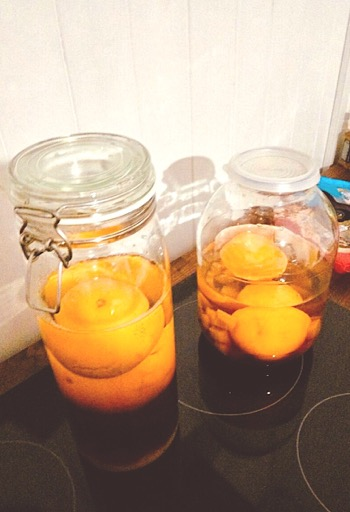

# 44

В рецепте этой настойки очень часто встречается число **44**, не знаю почему не 42, не я рецепт придумывал.  
Подходит как опередив и как основное блюдо. Также, можно подавать этот напиток и на шаг ноги, чтобы гости благополучно добрались до дома.     

| Чего                         | Сколько      |
| ---------------------------- | ------------ |
| водки                        | 1 литр       |
| апельсинов                   | 2 штуки      |
| зерен кофе                   | **44** штуки |
| кубиков тростникового сахара | **44** штуки |

В каждом апельсине делаем по 22 небольших надреза ножем и вставляем в каждый надрез по кофейному зерну.   
Закладываем эти апельсины в какую-нибудь тару с подходящим горлышком. В эту же тару добавляем **44** кубика тростникового сахара и заливаем одним литром водки.    

Оставляем настаиваться на **44** дня. Переливаем продукт из тары в красивые бутылочки и можно подавать к столу.    

### Подача

Напиток подается в рюмках, которые можно  предварительно засунуть на пол часика в морозиловку.    

Хорошо заходит как теплым, так и сильно охлажденным.    

Можно пить залпом, либо неторопясь потягивать и наслаждаться шикарным букетом вкусов и ароматов.    

