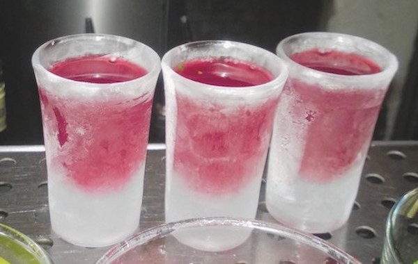

# Cherry

Данный рецепт подбрит у барменов легендарного **Saxone+Parole**.  

В данном рецепте помимо вкусной настойки, получается еще и очень вкусная вишня.   
Эта вишня станет достойным украшением вашего авиэйшна, олд фэшна или педро манхэттена.

| Чего                         | Сколько      |
| ---------------------------- | ------------ |
| Замороженная вишня           | 1 кг       |
| Вишневый ликер (Мараскино или любой другой)| 200 мл      |
| Коньяк                   | 200 мл |
| Бурбон                   | 200 мл |
| Корица, гвоздика, мята, цедра апельсина| всё по вкусу |
| Сахар                    | 200 г |

Все ингредиенты налить/засыпать/засунуть в какую-нибудь тару (например, в 3-х литровую банку).  
Настаивать 7 дней.  
После чего, процедить содержимое тары и разлить продукт по красивым бутылкам.  
Вишню можно сложить в какую-нибудь баночку и подавать на шпажке вместе с напитками.

### Подача

Перед подачей необходимое количество продукта нужно простировать 40 секунд в стакане со льдом (при желании можно еще немного добавить крепкого алкоголя).   

Напиток подается в рюмках, которые можно предварительно засунуть на пол часика в морозиловку.    
  
Enjoy!

